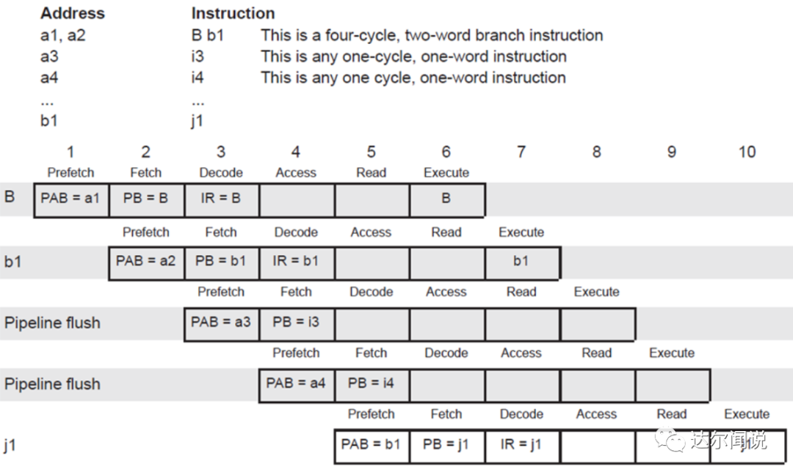
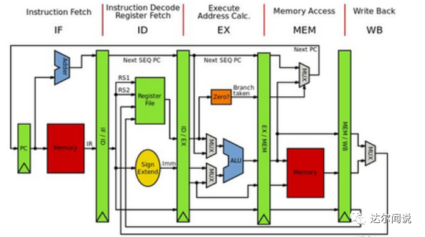

## 简化的RISC_CPU设计

RISC（Reduced Instruction Set Computer）精简指令集计算机，与一般的CPU相比不仅只是简化了指令系统，而且还通过简化指令系统是计算机的结构更加简单合理从而提高了运算速度

计算机信息处理分为两个步骤

1. 将数据和程序（即指令序列）输入到计算机的存储器中
2. 从第一条指令的地址起开始执行该程序，在异常是退出，知道指令执行完成
3. 取指令=>分析指令=>执行指令

CPU功能进一步细化

1. 能对指令进行译码并执行规定的动作
2. 可以进行算数和逻辑运算
3. 能与存储器和外设交换数据
4. 提供整个系统所需要的控制

CPU内部至少要包含的组件

1. 算数逻辑运算部件（ALU）
2. 累加器
3. 程序计数器
4. 指令寄存器和译码器
5. 时序和控制部件

RISC_CPU是一个复杂的数字逻辑电路，但是基本不见的逻辑并不复杂，可以把它分为8个部件来考虑

1. 时钟发生器
2. 指令寄存器
3. 累加器
4. 算数逻辑运算单元
5. 数据控制器
6. 状态控制器
7. 程序计数器
8. 地址多路器

RISC_CPU指令系统和寻址方式

1. 指令系统由8条指令构成

   1. HLT：停机操作，该操作将空一个指令周期，即8个时钟周期
   2. LDA：读数据，该操作将指令中给出地址的数据放入累加器
   3. STO：写数据，该操作将累加器中的数据放入指令中给出的地址
   4. SKZ：为0跳过下一条语句，该操作先判断当前的ALU中的结果是否为0，为0跳过下一条语句，否则继续执行
   5. JMP：无条件跳转语句，该操作将跳转至指令给出的目的地址，继续执行
   6. ADD：相加，该操作将累加器中的值与地址所指的存储器或端口的数据相加，结果仍送回累加器中
   7. AND：相与，该操作将累加器中的值与地址所指的存储器或端口的数据相与，结果仍送回累加器中
   8. XOR：相异或，该操作将累加器中的值与地址所指的存储器或端口的数据相异或，结果仍送回累加器中

2. 寻址方式

   RISC_CPU是8位微处理器，一律采用直接寻址的方式，即数据总是放在处处器中，寻址单元的地址有指令直接给出，这是最简单的寻址方式

RISC_CPU的主要操作

1. 系统的复位和启动操作
2. 总线读操作
3. 总线写操作

经典5级RISC

处理器的流水线结构是处理器微架构最基本的一个要素，承载并决定了处理器其他微架构的细节。指令从取值到真正执行的过程划分成多个小步骤，CPU真正开始执行指令序列时，一步压一步的执行，减少其等待时间。一般来讲，**流水线级数越多，工作效率越高**。Intel处理器的流水线级数远超过嵌入式CPU的流水线级数。

经典的RISC架构CPU通常可以分为五个连续的组成部分，即五级流水线线，每个部分的名称和功能可以概括为：

**取指**（Instruction Fetch——IF）：本阶段主要是根据PC寄存器的值来从存储器相应地址中读取对应的指令信息的过程。

**译码**（Instruction Decode——ID）：指令译码是指将存储器中取出的指令进行翻译的过程。经过译码之后得到指令需要的操作数寄存器索引，可以使用此索引从通用寄存器组（Register File，Regfile）中将操作数读出。

**执行**（Instruction Execute——IE/EX）：指令译码之后所需要进行的计算类型都已得知，并且已经从通用寄存器组中读取出了所需的操作数，那么接下来便进行指令执行。指令执行是指对指令进行真正运算的过程。譬如，如果指令是一条加法运算指令，则对操作数进行加法操作；如果是减法运算指令，则进行减法操作。

在“执行”阶段的最常见部件为算术逻辑部件运算器（Arithmetic Logical Unit，ALU），作为实施具体运算的硬件功能单元。

**访存**（Memory Access——MEM）：存储器访问指令往往是指令集中最重要的指令类型之一，访存是指存储器访问指令将数据从存储器中读出，或者写入存储器的过程。

**写回**（Write-Back——WB）：写回是指将指令执行的结果写回通用寄存器组的过程。如果是普通运算指令，该结果值来自于“执行”阶段计算的结果；如果是存储器读指令，该结果来自于“访存”阶段从存储器中读取出来的数据。

一个简单的五级流水线指令执行过程时空图如下图所示，从图中我们可以看出，随着时钟周期的深入，最终将同时有五条指令处在不同的处理阶段，这就十分明显的增加了系统对指令的吞吐速率。

具有完整功能的五级流水线CPU组成结构如图所示。在不同的阶段，有专门的电路结构来负责完成相应的功能，通常情况下，流水线结构由组合逻辑和时序逻辑组合完成，组合逻辑主要负责各个阶段的功能执行，而时序逻辑则主要负责完成各级流水线之间的数据传递过程。

在CPU流水线执行过程中，因为流水线在某个阶段会执行多条指令的不同过程，就出现了经典的三个冲突问题：

结构冲突：由于硬件资源不足导致的不同指令重叠执行要求而产生，比如冯诺依曼结构中经典的程序和数据读取的冲突。

数据冲突：当指令在流水线中重叠执行时，因当前指令需要用到前面某条指令的结果而产生的冲突。

控制冲突：流水线遇到分支指令或者跳转指令等需要影响PC寄存器递增方式而产生的冲突。

控制器是整个CPU的核心部分，用于产生一系列的控制信号，启动或者停止某些部件。CPU何时进行读取RAM/ROM的数据以及对RAM进行写操作都是通过状态机来控制的。执行一条指令需要8个时钟周期，由state从0~7计数。每一个时钟周期都完成固定的操作。简单讲，就是对**inc_pc,load_acc,load_pc,rd,wr,load_ir,HALT,datactr_ena**这8个控制信号进行赋值。

- **000：**指令寄存器存放ROM送来的高8位指令代码。
  1. **inc_pc,rd,load_ir**置于高位，其余置于低位。
  2. 程序计数器加一，将rom中的数据读出到总线上，指令寄存器将寄存来自总线上的高8位指令。
- **001：**指令寄存器存放ROM送来的低8位指令。
  1. **inc_pc,rd,load_ir**置于高位，其余置于低位。
  2. 程序计数器加一（指向下一条指令的地址），将rom中的数据读出到总线上，指令寄存器将寄存来自总线上的低8位指令。
- **010：**空操作。
  1. 所有信号置于低位。
  2. 用作数据的缓冲。
- **011：**，根据操作码做不同的操作。
  1. 如果操作码为HLT，**HALT**置于高位，其余置于低位。
  2. 如果操作码不是HLT，所有信号置于低位。
- **100：**，根据操作码做不同的操作。
  1. 如果操作符为AND、ADD、XOR、LDA，读相应地址的数据，**rd**置于高位，其余置于低位。
  2. 如果操作符为JMP，将目的地址送给程序计数器，**load_pc**置于高位，其余置于低位。
  3. 如果操作符为STO，将累加器上的数据放入指令给出的地址，**datactr_ena**置于高位，其余置于低位。
  4. 如果操作符不是上述情况，所有信号置于低位。
- **101：**根据操作码做不同的操作。
  1. 如果操作符为AND、ADD、XOR、LDA，算术运算器要做出相应的计算，**rd、load_acc**置于高位，其余置于低位。
  2. 如果操作符为SKZ，先判断累加器的值是否为0，如果是0，则**inc_pc**置于高位，其余置于低位；否则所有信号置于低位。
  3. 如果操作符为JMP，锁存目标地址，**load_pc**置于高位，其余置于低位。
  4. 如果操作符为STO，将累加器上的数据写入指定地址，**wr，datactr_ena**置于高位，其余各位置于低位。
  5. 如果操作符不是上述情况，所有信号置于低位。
- **110：**空操作。不对指令做出相应，**控制总线上的输出数据**。
  1. 如果操作符为STO，**datactr_ena**置于高位，其余置于低位。
  2. 如果操作符为AND、ADD、XOR、LDA，**rd**置于高位，其余置于低位。
  3. 如果操作符不是上述情况，所有信号置于低位。
- **111：**根据操作码不同做不同的操作。
  1. 如果操作符为SKZ且累加器的输出为0，**inc_pc**置于高位，其余置于低位。
  2. 如果不是上述操作符，所有信号置于低位。